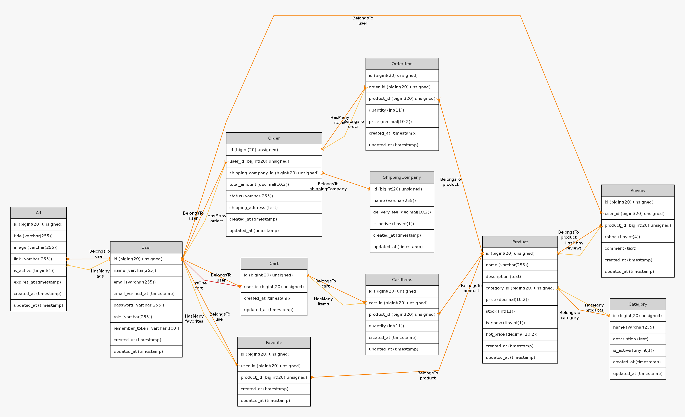

# 🛒 e-Store Backend (Laravel)

## 📌 Overview

<p align="center">
  
</p>

A scalable and well-structured E-commerce backend built with Laravel, designed to deliver secure and high-performance RESTful APIs.  
The system follows Clean Architecture principles, ensuring maintainability, flexibility, and clear separation of concerns.  

It handles core E-commerce functionalities such as user authentication, product management, cart operations, and order processing — making it suitable for real-world production environments.

<p align="center">
  
  
  
  
  
</p>

---

---

## 🧰 Tech Stack 
```text

Laravel – Powerful backend framework
PHP – Core programming language
MySQL – Relational database
Laravel Sanctum – API authentication
REST API – Standard communication architecture
Clean Architecture – Maintainable and scalable structure

```

## 🔄 Request Lifecycle

```text
Client Request
     ↓
Route (api.php / api/v1)
     ↓
Middleware (Auth / Admin / Rate Limit)
     ↓
Controller
     ↓
Service Layer
     ↓
Repository Layer
     ↓
Model (Eloquent)
     ↓
Database


Exception → Handler → JSON Error Response


Resource (API Resource) → JSON Response
```

---

## 🧭 ERD (Entity Relationship Diagram)




---

## 🚀 Running the Project

```bash
git clone https://github.com/your-username/e-store.git
cd e-store

composer install

cp .env.example .env
php artisan key:generate

php artisan migrate
php artisan serve
```

---

## 🧪 Testing

```bash
php artisan test
```

---
